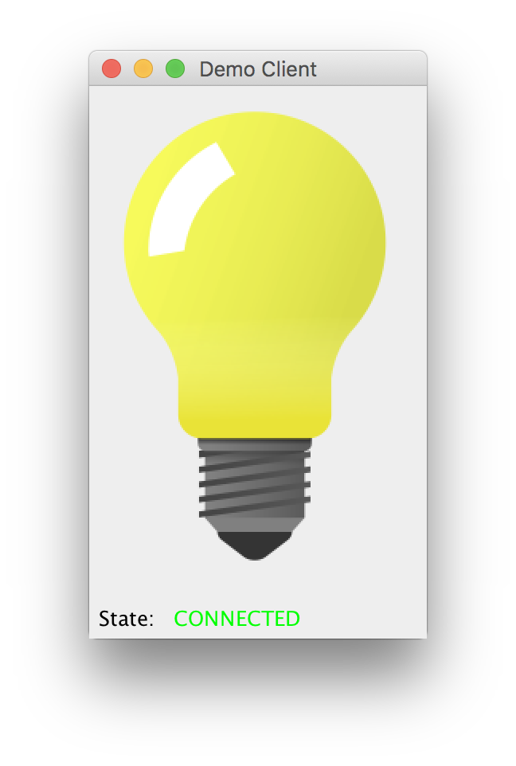

# Demo client for the DialogOS dialog system

This is a simple client for
[DialogOS](https://github.com/coli-saar/dialogos).  The purpose of
this client is to provide a working example for a DialogOS client.

The client displays a lightbulb, which can be turned on and off by
sending the strings "on" or "off" to the client:

 

The client listens on port 8888, and advertises its name as "DialogOS
Demo Client" over Rendezvous. Thus, you have two choices to connect to
it from DialogOS:

* Dialog -> Devices -> New -> CLT Connector (Fixed Server) with port 8888 on localhost.
* Dilaog -> Devices -> New -> CLT Connector (Rendezvous) with service name "DialogOS Demo Client" on localhost.

## Running the client

You have two choices for compiling the demo client:

1. Do `./gradlew run`
2. Do `./gradlew shadowJar` to compile once, and then run `java -jar build/libs/demo-dialogos-client-all.jar`.

